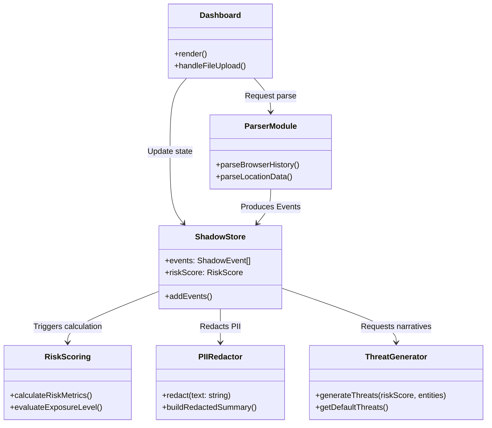
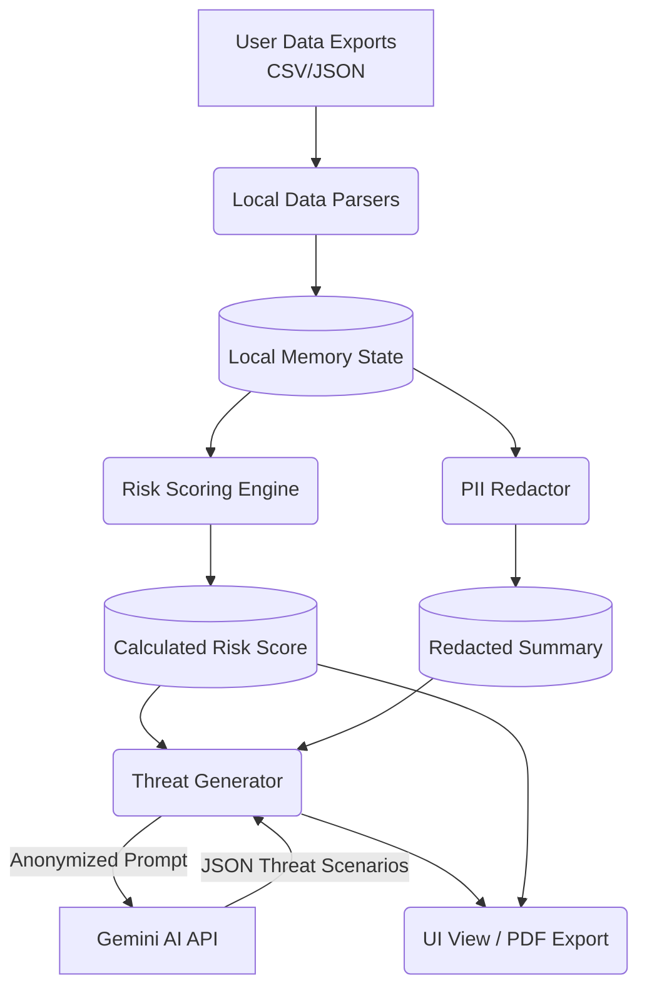
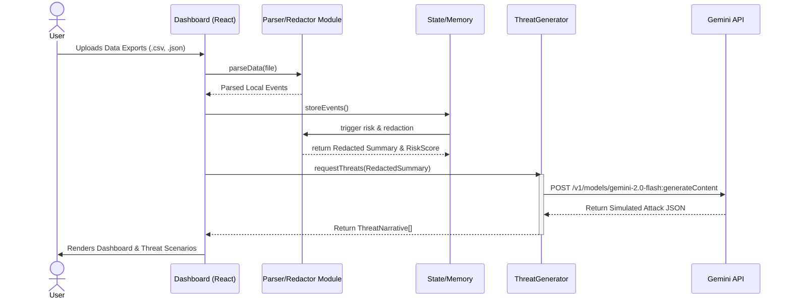

# DataShadow (PrivaSim) - Architecture Document

## Chosen Architecture: Serverless Architecture

For the **DataShadow (PrivaSim)** privacy audit tool, we have selected a **Serverless Architecture** (specifically, a Serverless Single-Page Application pattern combined with Backend-as-a-Service). 

### Short Explanation
Our application is designed as a purely front-end React application (SPA) that processes large amounts of sensitive digital footprint data (e.g., location history, browsing data) **locally** within the user's browser. Instead of maintaining our own traditional backend servers (which would introduce data privacy liabilities and scaling costs), we utilize a **Serverless** approach:
1. **Static/Serverless Hosting**: The entire frontend application is bundled and can be deployed to a serverless CDN (like Vercel, Netlify, or AWS CloudFront). 
2. **Local Compute**: All data parsing, PII redaction, and risk scoring logic execute locally on the client's device.
3. **Serverless APIs (BaaS)**: For heavy, dynamic processing (generating realistic cyber threat narratives), the application directly securely calls third-party serverless APIs (Google Gemini AI) using exclusively anonymized/redacted data summaries.

This approach guarantees user privacy (no PII leaves the device), high scalability (no server bottlenecks), and minimal operational overhead.

---

## Architecture Diagrams

### 1. Use Case Diagram
This diagram outlines the primary interactions between the User and the DataShadow system.

```mermaid
usecaseDiagram
    actor "User" as U
    actor "Google Gemini API" as AI

    package "DataShadow System" {
        usecase "Upload Data Exports" as UC1
        usecase "Parse & Normalize Data" as UC2
        usecase "Redact PII Locally" as UC3
        usecase "Calculate Risk Score" as UC4
        usecase "Generate Threat Scenarios" as UC5
        usecase "View Privacy Dashboard" as UC6
        usecase "Export PDF Report" as UC7
    }

    U --> UC1
    U --> UC6
    U --> UC7
    
    UC1 ..> UC2 : includes
    UC2 ..> UC3 : includes
    UC2 ..> UC4 : includes
    
    UC6 ..> UC5 : includes
    UC5 <--> AI : "Sends Redacted Summary\nReceives Threats"
```

### 2. Class Diagram
This diagram shows the main logical classes and modules of the system.



### 3. Data Flow Diagram (DFD) - Level 1
Illustrates the flow of sensitive data through the application and how it gets transformed and redacted before external calls.



### 4. Component Diagram
Shows the structural components of the React application and their dependencies.

```mermaid
componentDiagram
    package "User Browser Layer" {
        [UI Components]
        [State Management (Zustand/Context)]
        
        folder "Core Engine" {
            [Data Parsers]
            [PII Redactor]
            [Risk Scorer]
        }
        
        folder "Ext Integration" {
            [Threat GenAI SDK]
        }
    }
    
    [UI Components] --> [State Management (Zustand/Context)]
    [UI Components] --> [Core Engine]
    [State Management (Zustand/Context)] --> [Core Engine] 
    [State Management (Zustand/Context)] --> [Threat GenAI SDK]
    [Threat GenAI SDK] ..> [Google Gemini API] : HTTPS
```

### 5. Sequence Diagram
Demonstrates the chronological sequence of events when a user uploads data to generate local threats.



### 6. Deployment Diagram
Illustrates the serverless physical deployment of the application.

```mermaid
deploymentDiagram
    node "User Device (Client)" {
        node "Web Browser" {
            artifact "React SPA Bundle (JS/CSS/HTML)"
            component "Local Storage / Memory"
            component "Web Workers (Parsing)"
        }
    }
    
    node "Serverless CDN (e.g., Vercel / Cloudflare)" {
        artifact "Static Assets"
    }
    
    node "Google Cloud Platform" {
        component "Gemini Serverless API"
    }
    
    "Web Browser" -- "HTTPS (Download App)" : "Serverless CDN (e.g., Vercel / Cloudflare)"
    "Web Browser" -- "HTTPS (API Call)" : "Google Cloud Platform"
```
